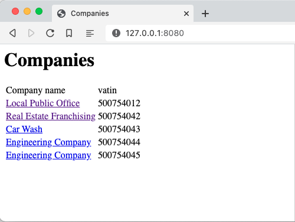
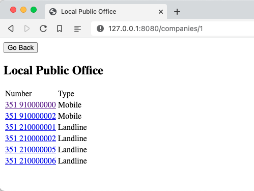
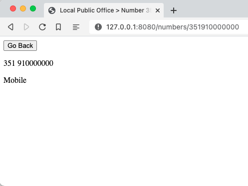

# Frontend Project

This assessment project, its composed of a demo api and a demo client.

The website builded is simple:

in `/` the user can see the company list

*clicking on a company, the page navigates to `/company/:companyId`*

in `/company/:companyId` the user can see a table of numbers that belong to that company

*clicking on a number the page navigates to `/number/:numberId`*

in `/number/:numberId` the user can see the number details

in both `/number/:numberId` and `/companies/:companyId` have a `Go Back` button that goes to the previous page

# Prerequisites
Install [node.js](https://nodejs.org/en/) which includes [npm](https://npmjs.com) with any of these versions " ^12.22.0 || ^14.17.0 || >=16.0.0 "

In `/api` folder run: `npm install`

In `/client` folder run: `yarn install`

## Running

1. Run `yarn start` to start the [client](#client)
1. Run `npm run api` to start the [API](#api)

## Client
Was used the most recent version of [React](https://reactjs.org/) and [React Router](https://github.com/remix-run/react-router) with the typescript template. The the website is located in `/client`.

You should then have the demo website running in `http://localhost:4000`

## API

The REST API is based on [json-server](https://www.npmjs.com/package/), and the data is defined in [db.json](db.json) file. To start it simply run:

You should then have the API running in http://localhost:3000.

